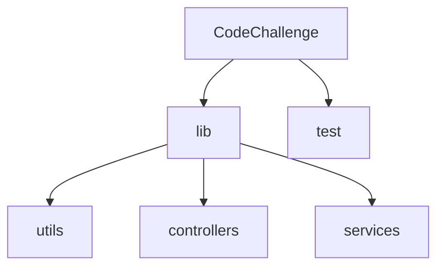
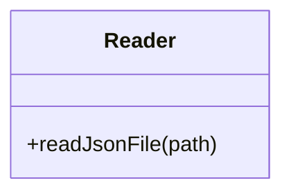
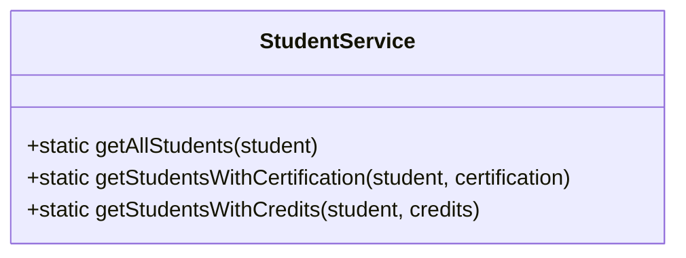
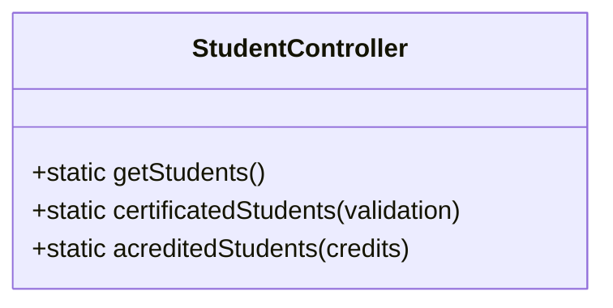
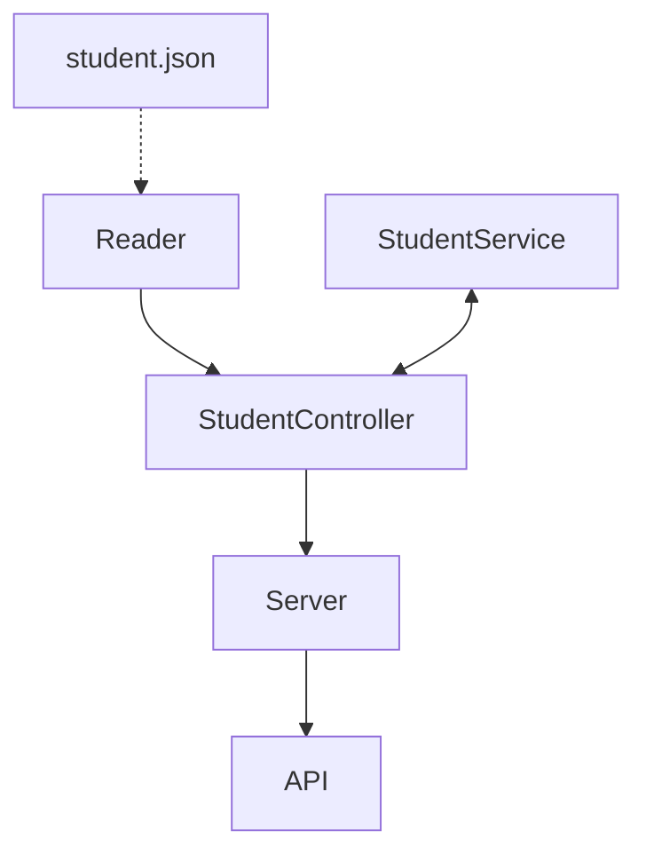

# CodeChallenge | 
Project for LaunchX by AntGtz.

## Requerimentos Code Challenge (Semana 4)

1. Habilitar un endpoint para consultar todos los estudiantes con todos sus campos.
2. Habilitar un endpoint para consultar los emails de todos los estudiantes que tengan certificación `haveCertification`.
3. Habilitar un endpoint para consultar todos los estudiantes que tengan `credits` mayor a 500.

## Creación del proyecto
```
npm init
```

## Dependencias usadas crear el proyecto

 - `Jest 28.0.3`:  Para la verificacion del correcto funcionamiento del codigo
 - `Express 4.18.1`: Para poder crear un servidor local(localhost).
 - `ESLint 8.14.0`:  Para lograr tener un control de legibilidad del codigo.
 - `test.yml`:  Para automatizar las Pruebas de Unidad en github, es decir, verificar que en cada push al repositorio, se realicen las pruebas de codigo y comprobar que este funciona correctamente.

## Estructura de directorio


La estructura del proyecto es la siguiente

#### Carpeta `lib`

- Carpeta `utils`: Aquí tenemos un archivo `Reader.js` con una clase auxiliar `fs` en el cual se crea la clase `Reader` que inspecciona el `student.json` y lo exporta para su uso.

- Carpeta `services`: Tenemos un archivo `StudentService.js` en el cual se crea una clase llamada `StudentService` para realizar toda la lógica que se necesita y exportala, alli creamos métodos estáticos para los requerimientos, los cuales son:
    - `static getAllStudents(student)` - Con este método retornamos la lista de los estudiantes del archivo `students.json`.
    - `static getStudentWithCertification(student, certification)` - Este método filtra los students cuya certificacion sea igual al parametro certification, para posteriormente utilizar map para solo devolver los emails de los estudiantes.
    Se podria hacer con un solo parametro, sin embargo al usar certification como parametro, tambien se podria visualizar la lista de otros estudiantes cuya certificacion sea false.
    - `static getStudensWithCredits(student, credits)` - Este metodo nos devuelve la lista de estudiantes que tienen mas de la cantidad de creditos establecida en el parametro credits

- Carpeta `controllers`: En esta carpeta tenemos un archivo `StudentController.js` para uso de exclusivo de `StudentService`, se crea en el archivo una clase llamada `StudentController` en el cual se crea metodos estáticos para conectar el API y el Servidor, importamos las clases `Reader` y `StudentService`, además de exportar el módulo. Los métodos creados son los siguientes:
    - `static getStudents()` - Con este método retornamos la lista de los estudiantes del archivo `students.json`.
    - `static certificatedStudents(validation)` - Con este método conectamos el archivo `students.json` con `studentService`para los estudiantes que tengan certificación.
    - `static acreditedStudents(credits)` - Con este método conectamos el archivo `students.json` con `studentService` para los estudiantes con creditos.

#### Carpeta `test`
Tenemos un archivo `StudentService.test.js` con 3 pruebas que validan el requerimiento.
El archivo `StudentController.test.js` con pruebas que validan los datos recibidos desde el archivo `JSON` y serán los que recibirá el `Server`.
El archivo `Reader.test.js` tiene una validacion para verificar que se lea el archivo `students.json`

#### Archivo `students.json`
- La db en el archivo `students.json` se tomo de la lista de estudiantes de <a href="https://gist.github.com/carlogilmar/1f5164637fb77aecef3b9e6b9e2a9b63">Visual Partner-Ship</a>

### Diseño de todos los componentes


### Archivo `server.js`
    - En el archivo se crea el servidor con Express, en el cual se crean los endpoints para los diferentes requerimientos, con `app.get`.

#### Funcionalidad:

| Endpoint | Request | Response |
|---|---|---|
| `localhost:3000/v1/students` | `localhost:3000/v1/students` | Deberás obtener la lista de todos los estudiantes y sus datos |
| `localhost:3000/v1/students/email` | `localhost:3000/v1/students/email` | Se obtienen los emails de los estudiantes que tienen certificacion |
| `localhost:3000/v1/students/credits/:number` | `localhost:3000/v1/students/credits/500` | Deberás obtener la lista de usernames con mas de 500 creditos |